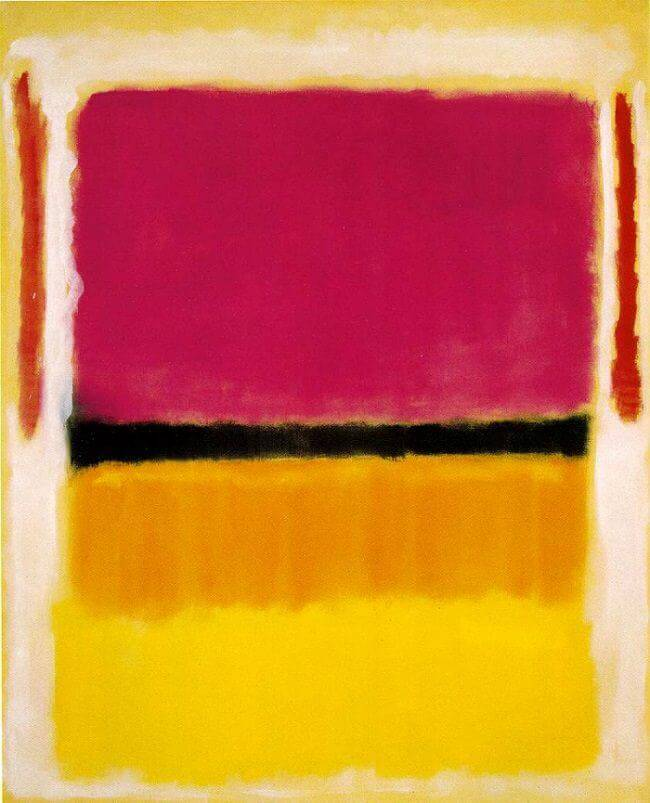

---
output:
  md_document:
    variant: markdown_github
---

<!-- README.md is generated from README.Rmd. Please edit that file -->

```{r, echo = FALSE}
knitr::opts_chunk$set(
  collapse = TRUE,
  comment = "#>",
  fig.path = "figure/",
  fig.height = 1
)
```

# Rothko Palettes
[](https://travis-ci.org/mmerrittsmith/rothko)


> Violet, Black, Orange, Yellow on White and Red, 1949

Mark Rothko is an 20th-century American painter best known for his later work on "multi-forms" or "colour fields". These paintings consist of large blocks of colors that, despite being abstract forms, convey a wide array of human emotion. Much of this is achieved through composition, but color plays a large part as well. 

This project provides R color palettes derived from some of Rothko's most well-known works. It is directly derivative of the . 

## Installation

```r
install.packages("rothko")
```

__Or the development version__

```r
devtools::install_github("mmerrittsmith/rothko")
```

## Usage
```{r, palettes_dummy}
library("rothko")
# See all palettes
names(rothko_palettes)
```

## Palettes

### Magenta, Black, Green on Orange

```{r, mbgoo}
rothko_palette("Magenta, Black, Green on Orange")
```

### Untitled 1949
```{r, untitled1949}
rothko_palette("Untitled 1949")
```

### Number 5
```{r, number5}
rothko_palette("Number 5")
```

### Violet, Black, Orange, Yellow on White and Red
```{r, vboyowar}
rothko_palette("Violet, Black, Orange, Yellow on White and Red")
rothko_palette("Violet, Black, Orange, Yellow on White and Red2")
```

### White Center
```{r, whitecenter}
rothko_palette("White Center")
```

### Blue, Green, and Brown
```{r, bluegreenbrown}
rothko_palette("Blue, Green, and Brown")
```

### Purple, White, and Red
```{r, purplewhitered}
rothko_palette("Purple, White, and Red")
```

### Number 10
```{r, number10}
rothko_palette("Number 10")
```

### Rust and Blue
```{r, rustandblue}
rothko_palette("Rust and Blue")
```

### Untitled 1953
```{r, untitled1953}
rothko_palette("Untitled 1953")
```

### Ochre and Red on Red
```{r, ochreandredonred}
rothko_palette("Ochre and Red on Red")
```

### Red, Black, White on Yellow
```{r, redblackwhiteonyellow}
rothko_palette("Red, Black, White on Yellow")
```

### Green and Tangerine on Red
```{r, gtor}
rothko_palette("Green and Tangerine on Red")
```

### Light Red Over Black
```{r, lrob}
rothko_palette("Light Red Over Black")
```

### Light Cloud, Dark Cloud
```{r, lcdc}
rothko_palette("Light Cloud, Dark Cloud")
```

### Number 14
```{r, number14}
rothko_palette("Number 14")
```

### Orange, Red, Yellow
```{r, ory}
rothko_palette("Orange, Red, Yellow")
```

### Number 16
```{r, number16}
rothko_palette("Number 16")
```

### Blue and Grey
```{r, blueandgrey}
rothko_palette("Blue and Grey")
```

### Untitled 1969
```{r, untitled1969}
rothko_palette("Untitled 1969")
```