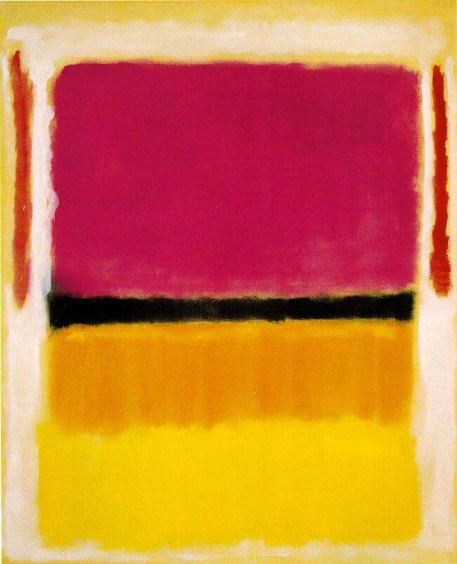

<!-- README.md is generated from README.Rmd. Please edit that file -->
Rothko Palettes
===============

[](https://travis-ci.org/mmerrittsmith/rothko)

 &gt; Violet, Black, Orange, Yellow on White and Red, 1949

Mark Rothko is an 20th-century American painter best known for his later work on "multi-forms" or "colour fields". These paintings consist of large blocks of colors that, despite being abstract forms, convey a wide array of human emotion. Much of this is achieved through composition, but color plays a large part as well.

This project provides R color palettes derived from some of Rothko's most well-known works. It is directly derivative of the .

Installation
------------

``` r
install.packages("rothko")
```

**Or the development version**

``` r
devtools::install_github("mmerrittsmith/rothko")
```

Usage
-----

``` r
library("rothko")
# See all palettes
names(rothko_palettes)
#>  [1] "Magenta, Black, Green on Orange"                
#>  [2] "Untitled 1949"                                  
#>  [3] "Number 5"                                       
#>  [4] "Violet, Black, Orange, Yellow on White and Red" 
#>  [5] "Violet, Black, Orange, Yellow on White and Red2"
#>  [6] "White Center"                                   
#>  [7] "Blue, Green, and Brown"                         
#>  [8] "Purple, White, and Red"                         
#>  [9] "Number 10"                                      
#> [10] "Rust and Blue"                                  
#> [11] "Untitled 1953"                                  
#> [12] "Ochre and Red on Red"                           
#> [13] "Red, Black, White on Yellow"                    
#> [14] "Green and Tangerine on Red"                     
#> [15] "Light Red Over Black"                           
#> [16] "Light Cloud, Dark Cloud"                        
#> [17] "Number 14"                                      
#> [18] "Orange, Red, Yellow"                            
#> [19] "Number 16"                                      
#> [20] "Blue and Grey"                                  
#> [21] "Untitled 1969"
```

Palettes
--------

### Magenta, Black, Green on Orange

``` r
rothko_palette("Magenta, Black, Green on Orange")
```


### Untitled 1949

``` r
rothko_palette("Untitled 1949")
```


### Number 5

``` r
rothko_palette("Number 5")
```


### Violet, Black, Orange, Yellow on White and Red

``` r
rothko_palette("Violet, Black, Orange, Yellow on White and Red")
```


``` r
rothko_palette("Violet, Black, Orange, Yellow on White and Red2")
```


### White Center

``` r
rothko_palette("White Center")
```


### Blue, Green, and Brown

``` r
rothko_palette("Blue, Green, and Brown")
```


### Purple, White, and Red

``` r
rothko_palette("Purple, White, and Red")
```


### Number 10

``` r
rothko_palette("Number 10")
```


### Rust and Blue

``` r
rothko_palette("Rust and Blue")
```


### Untitled 1953

``` r
rothko_palette("Untitled 1953")
```


### Ochre and Red on Red

``` r
rothko_palette("Ochre and Red on Red")
```


### Red, Black, White on Yellow

``` r
rothko_palette("Red, Black, White on Yellow")
```


### Green and Tangerine on Red

``` r
rothko_palette("Green and Tangerine on Red")
```


### Light Red Over Black

``` r
rothko_palette("Light Red Over Black")
```


### Light Cloud, Dark Cloud

``` r
rothko_palette("Light Cloud, Dark Cloud")
```


### Number 14

``` r
rothko_palette("Number 14")
```


### Orange, Red, Yellow

``` r
rothko_palette("Orange, Red, Yellow")
```


### Number 16

``` r
rothko_palette("Number 16")
```


### Blue and Grey

``` r
rothko_palette("Blue and Grey")
```


### Untitled 1969

``` r
rothko_palette("Untitled 1969")
```


